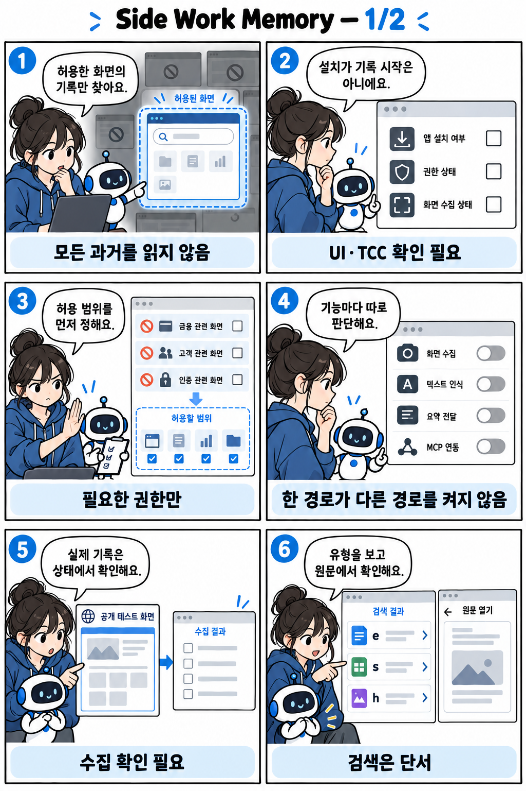
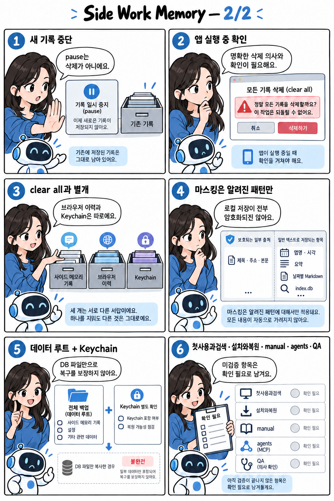

*Version: v1.2 (2026-09-27)* — 2026-09-27 upstream merge(fd383cd)·재빌드·재설치를 반영하고 업데이트 점검 기록을 연결했습니다.

# Side Work Memory 운영가이드

**Side는 허용한 앱에서 관찰한 작업 내용을 시간과 함께 기록하고 다시 찾는 도구입니다.** 관찰하지 않은 화면이나 제외한 앱의 기록까지 복원하지 않습니다. 이 파일이 로컬 운영 SSOT입니다.

## 설명만화

이 가이드는 2페이지 설명만화로 볼 수 있습니다. [1/2](운영가이드_만화설명.png) · [2/2](운영가이드_만화설명_02.png) · [사실·프롬프트·검수 기록](image_side-work-memory_explainer_20260926.md)

## 시작 전에 판단할 것

설치와 기록 활성화는 별개입니다. 2026-09-25 설치 기록은 `/Applications/Side.app`과 번들 CLI를 확인했지만 실행·권한 부여·상시 기록·외부 요약·에이전트 연결은 활성화하지 않았습니다. 현재 실행 상태는 이번 갱신에서 확인하지 않았습니다.

첫 시험은 공개 문서로 제한하고, 제외 앱·사이트와 수집 설정을 먼저 확인합니다. 요약 제공자 전송과 MCP 연결은 각각 별도 선택입니다. 요약을 꺼도 에이전트에 전달한 검색 결과는 외부 모델로 갈 수 있습니다.

## 작업별 읽을 문서

| 작업 조건 | 먼저 읽을 문서 | 필요한 이유 |
|---|---|---|
| 첫 기록·권한·검색·pause·삭제 | [첫 사용과 검색](운영가이드.d/첫사용과검색.md) | 수집·중단·삭제와 외부 전송 경계를 구분합니다. |
| 설치 위치·업데이트·백업·이전 85 복원 | [설치와 복원](운영가이드.d/설치와복원.md) | SSD·서명·Keychain·기존 프로젝트를 보존합니다. |
| 전체 기능과 설정 | [상세 설명서](docs/manual.md) | CLI·앱 설정별 동작을 확인합니다. |
| 에이전트 연결 | [에이전트 안내](docs/agents.md) | 검색 결과가 전달되는 범위를 확인합니다. |
| 설치 검증 근거 | [설치 점검 기록](docs/qa/local-install-85-20260925.md) | 완료 항목과 미검증 항목을 구분합니다. |
| 2026-09-27 업데이트 근거 | [업데이트 점검 기록](docs/qa/side-update-20260927-report.md) | 해당 기록 §7의 Keychain 승인 해소와 입력 모니터링·화면 기록 재승인 잔여를 확인합니다. |

## 항상 지킬 경계

**로컬 저장을 전체 암호화로 설명하지 않습니다.** 원본의 일부 민감 컬럼은 암호화되지만 메타데이터·요약·날짜별 Markdown·색인은 평문일 수 있습니다. 패턴 마스킹은 모든 비밀을 보장하지 않습니다.

`pause`는 새 수집을 멈추며 기존 자료를 삭제하지 않습니다. 원본 보관 기간이 지나도 요약과 색인이 남을 수 있습니다. `clear all`은 영구 삭제 의사와 정확한 대상을 확인한 뒤 상세 절차에 따라 실행합니다.

`doctor`는 제공자가 설정되어 있으면 연결 검사를 할 수 있으므로 무조건 오프라인 진단으로 취급하지 않습니다. 데이터 루트를 Google Drive에 두지 않으며 Keychain 키가 필요한 복원을 DB 파일 복사만으로 보장하지 않습니다.

## 현재 소스와 검증 범위

[package.json](package.json)은 `bun run build`, `bun test`, `bun run check`를 정의합니다. 모델 다운로드와 앱 설치는 문서 변경과 별도 작업입니다. 이번 갱신은 소스와 기존 설치 기록만 대조했으며 화면 조작·권한·실제 수집을 검증한 튜토리얼은 아닙니다.
